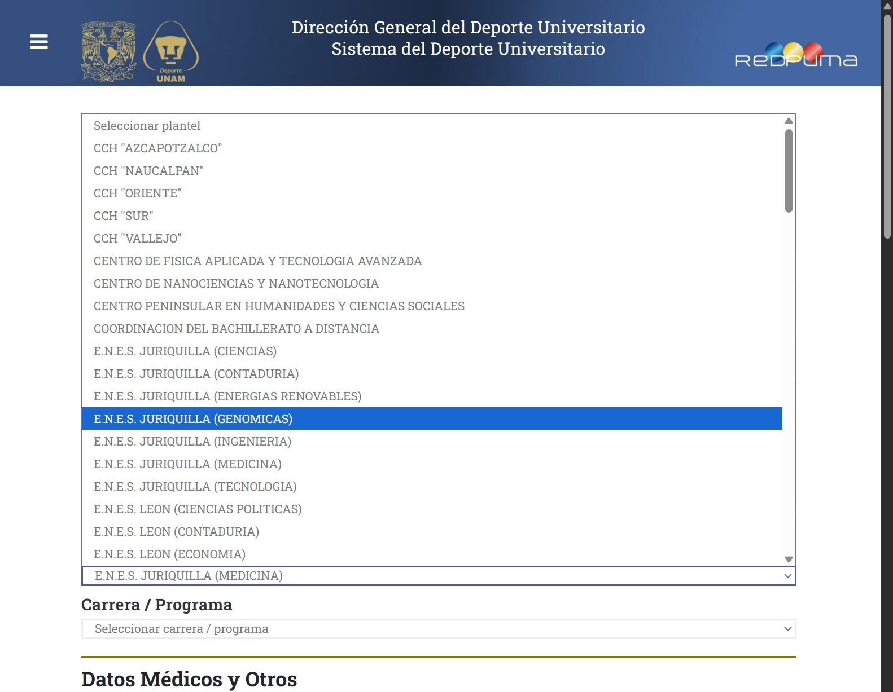

# Sistema de Gestión y Registro REDPUMA — DGDU UNAM

> Plataforma web institucional orientada al registro, validación dinámica de perfiles, control de acceso seguro y administración de datos para la comunidad universitaria.

##  Contexto
Proyecto desarrollado para la Dirección General del Deporte Universitario (DGDU, UNAM). La institución requería modernizar y asegurar la gestión de registros para alumnos y personal administrativo, implementando interfaces dinámicas, persistencia segura en bases de datos relacionales y blindaje de accesos contra manipulaciones o ataques automatizados.

---

##  Stack Tecnológico
* **Backend:** ASP.NET Web Forms, Visual Basic .NET (.NET Framework)
* **Frontend:** HTML5, CSS3 (Diseño responsivo con Flexbox), JavaScript nativo (ES6+)
* **Base de Datos:** Microsoft SQL Server (Diseño relacional, consultas DDL/DML, procedimientos y reglas de integridad)
* **Seguridad & Gráficos:** GDI+ (`System.Drawing`), variables de sesión (`Session State`), enlaces encriptados con caducidad temporal

---

##  Arquitectura y Módulos Desarrollados

### 1. Interfaz y Formularios Dinámicos
* **Segmentación de roles:** Lógica para clasificar si el usuario es alumno o trabajador administrativo, habilitando catálogos específicos de carreras o planteles según corresponda.
* **Componentes interactivos:** Listas y menús dependientes que se autorrellenan y adaptan en tiempo real sin recargar la página.
* **Validación en cliente:** Reglas de integridad con JavaScript para impedir el envío de datos nulos o formatos no válidos.

### 2. Capa de Datos y Persistencia (Backend & SQL)
* **Control CRUD:** Métodos en Visual Basic para la inserción ordenada de nuevos registros y actualización de expedientes existentes.
* **Manejo de excepciones:** Estabilización de flujos lógicos para prevenir caídas del servidor ante registros incompletos o valores nulos en la base de datos.
* **Integridad referencial:** Esquema estructurado en SQL Server asegurando la consistencia entre usuarios, roles y programas universitarios.

### 3. Seguridad de Enlaces y Verificación de Identidad
* **Procesamiento de URL cifradas:** Desencriptación en servidor de parámetros recibidos por correo electrónico (extracción directa de CURP y nombres).
* **Bloqueo de campos:** Carga automática y bloqueo de casillas críticas en la interfaz para prevenir manipulación por parte del usuario.
* **Control de caducidad:** Implementación de candados temporales que invalidan el acceso al enlace tras 24 horas.
* **Detección de estado:** Reconocimiento dinámico entre nuevos registros ("N") y solicitudes de actualización ("U").

### 4. Módulo de Autenticación y Desafío CAPTCHA
* **Generación de CAPTCHA dinámico:** Controlador independiente en Visual Basic que construye imágenes en mapa de bits (`Bitmap`) con operaciones matemáticas aleatorias.
* **Técnicas anti-OCR:** Inyección algorítmica de ruido visual (líneas aleatorias) sobre el gráfico para mitigar ataques automatizados (bots).
* **Persistencia segura:** Almacenamiento del resultado en el estado de sesión (`Session`) para validación estricta en servidor.
* **Experiencia de usuario:** Mensajes dinámicos de éxito y error inyectados directamente en la vista sin uso de alertas modales bloqueantes.

---

## 📷 Evidencia Visual

| Módulo de Registro y Formularios | Pantalla de Acceso y CAPTCHA |
| :---: | :---: |
|  |  |

---

## 📂 Estructura General del Proyecto
```text
├── App_Data/                # Esquemas y scripts de conexión SQL Server
├── Img/                     # Recursos visuales e identidad institucional
├── Login.aspx               # Interfaz de acceso y validaciones de usuario
├── Login.aspx.vb            # Verificación de credenciales y lógica de sesión
├── Captcha.aspx             # Endpoint para renderizado del reto gráfico
├── Captcha.aspx.vb          # Generador algorítmico del CAPTCHA en mapa de bits
├── Registro.aspx            # Formulario dinámico de captura y actualización
└── Registro.aspx.vb         # Operaciones CRUD y consultas contra la base de datos
